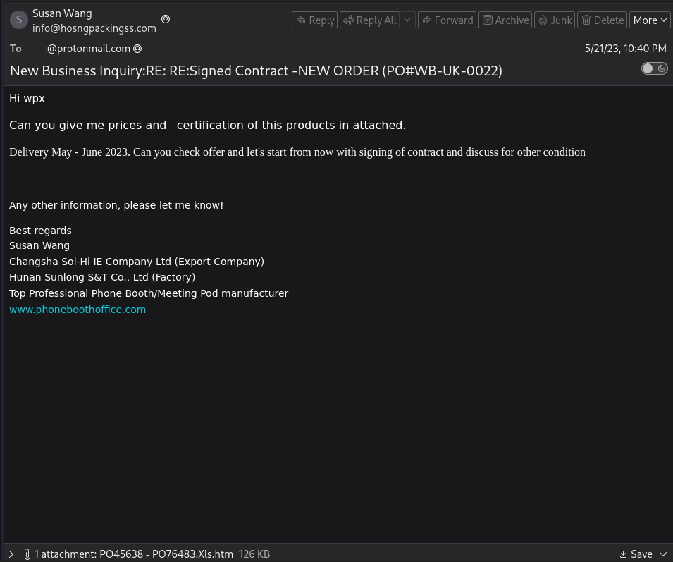
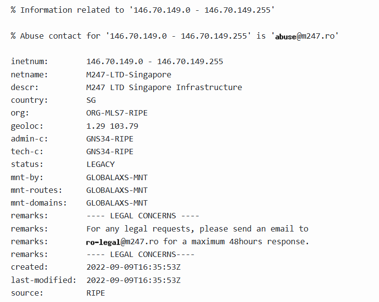
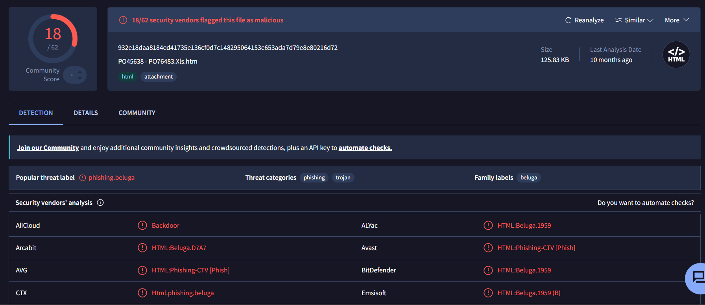
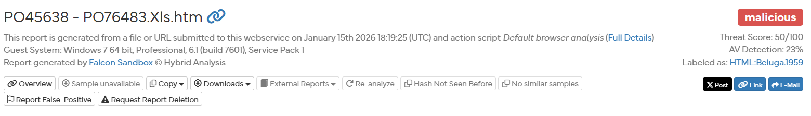
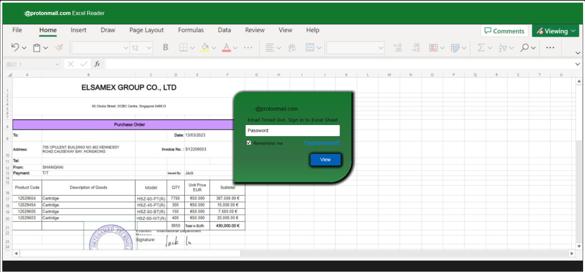
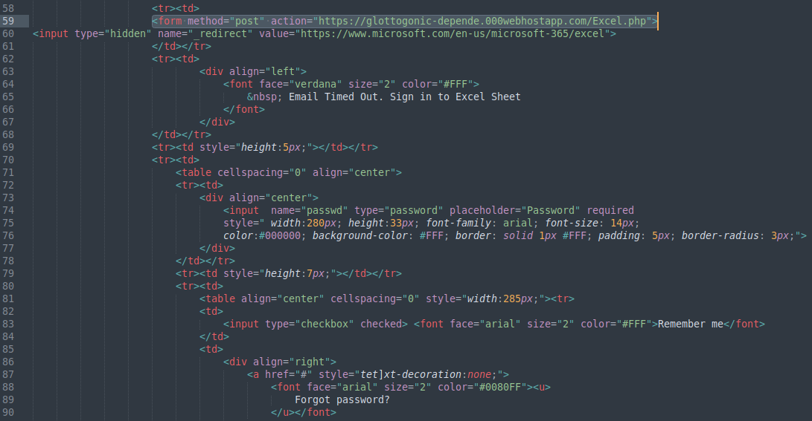

# Phishing analysis report:

<u>Verdict:</u>

Classification: Malicious (credential harvesting phishing email)
Severity: High
Confidence: High (Virus Total, Hybrid Analysis, SPF fail, typosquat)

<u>Screenshot of the email:</u>

## Section 1 : Email Description and Artifacts Retrieved:

<u>Email description</u>: 

The email is using business impersonation techniques and typosquatting techniques to appear to be from the legitimate company HosnG Packaging to ask to review an attached contract for a new order, it contains bad grammar and inconsistent layout and inconsistencies regarding the company the email is trying to impersonate between the sending email address (HosnG Packaging) and the companies cited in the body under the signature of the supposed sender.

<u>Artifacts</u>:  

Sending Email Address: info[@]hosngpackingss[.]com  
	Note: typosquat (hosngpackaginsS)

Date Sent: 21 May 2023 19:40:13

Sending Server IP: 146[.]70[.]149[.]246

Reverse DNS: DNS Record not found

Recipient(s): masked[@]protonmail.com

Subject: New Business Inquiry:RE: RE:Signed Contract -NEW ORDER (PO#WB-UK-0022)

Attachments name:  PO45638 - PO76483.Xls.htm
	Note: double file extension .xls.htm

Attachments SHA256 hash: 932e18daa8184ed41735e136cf0d7c148295064153e653ada7d79e8e80216d72

URL: hxxps://glottogonic-depende[.]000webhostapp[.]com/Excel.php
	Note: URL extracted from attachment static code analysis

Domain: glottogonic-depende[.]000webhostapp[.]com

## Section 2: Authentication results:

DMARC: none

SPF: fail 

DKIM: none

Remarks: SPF failed, showing the sending IP 146[.]70[.]149[.]246 is not authorized for the 
hosngpackingss[.]com domain, which is a strong indicator of spoofing.
## Section 3: Analysis:

<u>Sending server ip - whois:</u>

After checking, the sending server IP is registered to M247-LTD-Singapore, a hosting provider with a Singapore geolocation, showing discrepancies between the sending email address, which impersonates HosnG Packaging, based in China.  
MITRE ATT&CK T1656 - Impersonation

<u>Attachment file - File name:</u>

The attachment "PO45638 - PO76483.Xls.htm" uses a double file 
extension (.Xls.htm) to disguise an HTML file as a legitimate 
Excel spreadsheet for credential harvesting purposes (see Hybrid Analysis screenshot below).
MITRE ATT&CK T1036.007 - Masquerading: Double File Extension
File Extension

<u>Attachment file - VirusTotal:</u>

The attachment is flagged as malicious on VirusTotal and is categorized as a malware belonging to the Beluga phishing campaign using .htm files to capture companies' credentials. 
MITRE ATT&CK T1566.001 - Phishing: Spearphishing Attachment 

<u>Attachment file - Hybrid Analysis:</u>

Hybrid Analysis is also categorizing the file as malicious and provides with a screenshot of the detonated file, showing that it prompts the user for its credentials, while it impersonates a Microsoft Excel Reader window, acting as a credential harvester.
MITRE ATT&CK T1056.003 - Web Portal Capture and T1656 – Impersonation

<u>Attachment file - Static code analysis:</u>

After opening the .htm file with Sublime Text I found the URL (see line 59 on screenshot below) used used to POST the user credentials to an external website for later extraction by the attacker, with a redirect to a legitimate Microsoft website to conceal the malicious activity from the user, confirming the file acts as a credential harvester.
MITRE ATT&CK T1056.003 - Web Portal Capture

## Section 4: MITRE ATT&CK Mapping

| Tactic          | Technique ID | Technique Name                      |
| --------------- | ------------ | ----------------------------------- |
| Initial Access  | T1566.001    | Phishing: Spearphishing Attachment  |
| Defense Evasion | T1027.006    | Obfuscated Files: HTML Smuggling    |
| Defense Evasion | T1036.007    | Masquerading: Double File Extension |
| Defense Evasion | T1656        | Impersonation                       |
| Collection      | T1056.003    | Input Capture: Web Portal Capture   |

## Section 5: IOCs

| Type             | Indicator of compromise                                          |
| ---------------- | ---------------------------------------------------------------- |
| Sender address   | info[@]hosngpackingss[.]com                                      |
| File name        | PO45638 - PO76483.Xls.htm                                        |
| File SHA256 hash | 932e18daa8184ed41735e136cf0d7c148295064153e653ada7d79e8e80216d72 |
| URL              | hxxps://glottogonic-depende[.]000webhostapp[.]com/Excel.php      |
| Domain           | glottogonic-depende[.]000webhostapp[.]com                        |

## Section 5: Suggested Defensive Measures:

  - Email address and domain:
  I recommend to block emails coming from info[@]hosngpackingss[.]com and the domain hosngpackingss[.]com at the email gateway as the address is using typosquatting techniques to impersonate a legitimate brand.
  I also recommend to conduct a search in the email gateway logs for any emails coming from the sender address or domain.
  
- File hash and name:
I recommend to block the SHA256 hash of the malicious attachment 
(932e18daa8184ed41735e136cf0d7c148295064153e653ada7d79e8e80216d72) 
in the EDR and email gateway to prevent execution and delivery.
I also recommend to sweep the environment for the SHA-256 hash to detect any existing instances already present.

- URL and domain:
I recommend blocking access to the malicious URL at the proxy level hxxps://glottogonic-depende[.]000webhostapp[.]com/Excel.php as it is used to harvest and exfiltrate credentials. I also recommend blocking the parent domain glottogonic-depende[.]000webhostapp[.]com entirely, as it is used to conduct malicious activity and there is no legitimate business justification for employees to access it.

