## Active Directory Investigation Report

Analyst: Alexandre Favresse

Date of Analysis: 06-08-2024*

Report ID: AD-2026-001

Classification: True Positive 

Severity: Critical

Confidence: High 

**Note: The date has been modified to correspond to the date from the data on Splunk, the writeup was published on August 12, 2026.*

## Table of Contents

1. [Executive Summary](#section-1-executive-summary)
2. [Technical Summary](#section-2-technical-summary)
3. [Alert Context](#section-3-alert-context)
4. [Investigation Methodology](#section-4-investigation-methodology)
5. [Incident Timeline & MITRE ATT&CK Mapping](#section-5-incident-timeline--mitre-attck-mapping)
6. [Indicators of Compromise (IOCs)](#section-6-indicators-of-compromise-iocs)
7. [Suggested Defensive Measures](#section-7-suggested-defensive-measures)

## Section 1: Executive Summary

  On the 6th of August 2024 at 01:00 AM a malicious file was executed by the account of S. Anderson. **As a result, both the workstation and S. Anderson's user account were compromised.** The malicious file allowed the attacker to get more access in the organization's environment and compromise the account of T. Cooper, an account that seems to have higher rights within the environment. The attacker also established mechanisms to maintain access to compromised systems, meaning that simply removing the malicious file would not be sufficient to remove the threat.

  Afterwards, the attacker used the account of T. Cooper to pursue their attack and **gain access to the organization's File Server and centralized authentication system (Domain Controller), giving them access to sensitive data and control over the company's authentication infrastructure.** The attacker modified the defense mechanisms of the File Server and Domain Controller to obtain remote access to these endpoints from a device outside the organization's network.
  
  After obtaining access, the attacker gathered data from the Files Server and put it in a file for a possible data exfiltration. **While exfiltration has not been definitively confirmed, it is highly likely to have occurred based on the evidence gathered.**

  Notably, the entire attack, from malicious file execution to data collection, occurred **within a 16-minute window.**

  **This incident represented a critical risk to the confidentiality of the organization's data and the integrity of the organization's authentication infrastructure.** A detailed technical breakdown of the attack, along with suggested defensive measures to contain this incident and prevent similar attacks in the future, is presented in the remainder of this report.

## Section 2: Technical Summary

- **Trojan Execution:**

  At 01:05:11.925 on 6/08/2024, AdobeUpdater.exe was executed on the Office-PC endpoint under the sanderson account. The file was a repurposed Apache HTTP Server benchmark utility disguised to resemble a legitimate Adobe Updater program, and is thus classified as a trojan.

  It then made a connection to 223[.]247[.]47[.]74 over port 80 (to blend its traffic with legitimate web traffic) and dropped three other files, Rubeus.exe (renamed as BackupUtility.exe), PowerView.ps1 (renamed as SystemDiagnostics.ps1), and Mimikatz.exe (renamed as DefragTool.exe), seeming to act as a malware dropper.

  The malware modified a registry run key to execute a PowerShell script at the start of the user's session in order to establish persistence. The script has been found and will be provided to the DFIR team for reverse engineering.

  PowerView.ps1 (SystemDiagnostics.ps1) was then executed to enumerate and map the organization's Active Directory environment.

  While the source of AdobeUpdater.exe could not be established with the information present in the logs, there is a high probability that it was downloaded from a malicious website by the user sanderson as it was executed in their "Downloads" directory. This theory needs to be confirmed by asking the user where they downloaded the file from. 

- **Lateral movement:**

  Afterwards, the attacker performed lateral movement and obtained access to the tcooper account (which appeared to have higher privileges) by using what seemed to be an Overpass-the-Hash attack. It made a request for a Kerberos Ticket Granting Ticket and Ticket Granting Service ticket to logon via seclogon to the tcooper account using Rubeus.exe (BackupUtility.exe)

  Having compromised the tcooper account, the attacker launched Mimikatz.exe (DefragTool.exe) and performed lateral movement to access the File Server (FileServer) and the Domain Controller (DC01) using Windows Remote Management services.

- **Defense Impairment:**

  The attacker then impaired the defenses of each endpoint by enabling remote administrative services and Remote Desktop Protocol on each endpoint's firewall rules.

  Remote Desktop Protocol connections then occurred on both devices, initiated from 223[.]247[.]47[.]74, confirming that the attacker obtained remote access through a device external to the organization's environment, gaining control over the organization's authentication infrastructure and access to potentially sensitive files.

- **Data Collection:**

  The attacker opened a Powershell session in the C:\Shares directory of the File Server. This Powershell session created an archive file (CrashDump.zip) in C:\Users\Default\Local\Temp, indicating that the attacker's actions on objectives most likely involved data exfiltration.

  **Exfiltration remains unconfirmed but is assessed as highly likely given the available evidence.**

- **End of malicious activity:**

  Between the creation of the file at 01:21:04.278 and 03:52:54.311, no significant malicious activity was detected in the available logs.

  At 03:52:54.311, the sanderson account logged on again, and the registry run key created by the malware was executed, indicating that the malware was still present in the environment at this time. Gkape.exe was launched shortly after the logon, suggesting that this logon may have been initiated by the DFIR team. This information needs to be confirmed.

  **This activity indicates that the attacker compromised at least two user accounts, sanderson and tcooper, and three endpoints, Office-PC, DC01, and FileServer, and collected data on FileServer that was most likely exfiltrated.**

## Section 3: Alert Context

  "As a cybersecurity analyst at TechSecure Corp, you have been alerted to unusual activities within the company's Active Directory environment. Initial reports suggest unauthorized access and possible privilege escalation attempts"*

  **Note: The alert context and Splunk data are from CyberDefenders (https://cyberdefenders.org/blueteam-ctf-challenges/shadowroast/)*

## Section 4: Investigation Methodology

- **Identifying the compromised account**

  As the alert reported unauthorized access, I started my investigation by looking for failed logon attempts (event code 4625) and I found a suspicious failed logon attempt at 04:00:07.364 on the `FileServer` endpoint for the `FileSharService` account. 
Considering that the hour  of the fail logon is outside usual business work and that the sub status (0xC000006A) indicates that the username exists but the password entered is incorrect, I decided to investigate further this lead as this might indicate that malicious activity occurred.

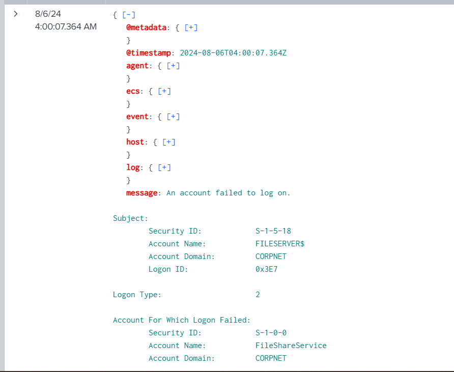
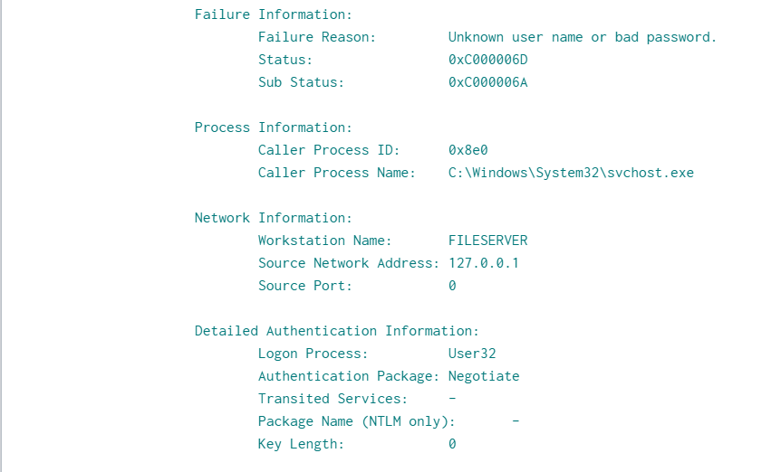

*Figure 1-2: Failed logon attempt (event code 4625) - 04:00:07.364*

- **Looking for a successful logon**

  To establish if the account might have been compromised, I filtered for both event codes 4624 and 4625 in a 30 seconds window around the failed logon attempt to find if a successful connection was made after the failed logon. I then found two successful logons that occurred just after the failed logon (at 04:00:11.946). These two sessions Logon IDs were `0x87AB7` and `0x87AD7`.

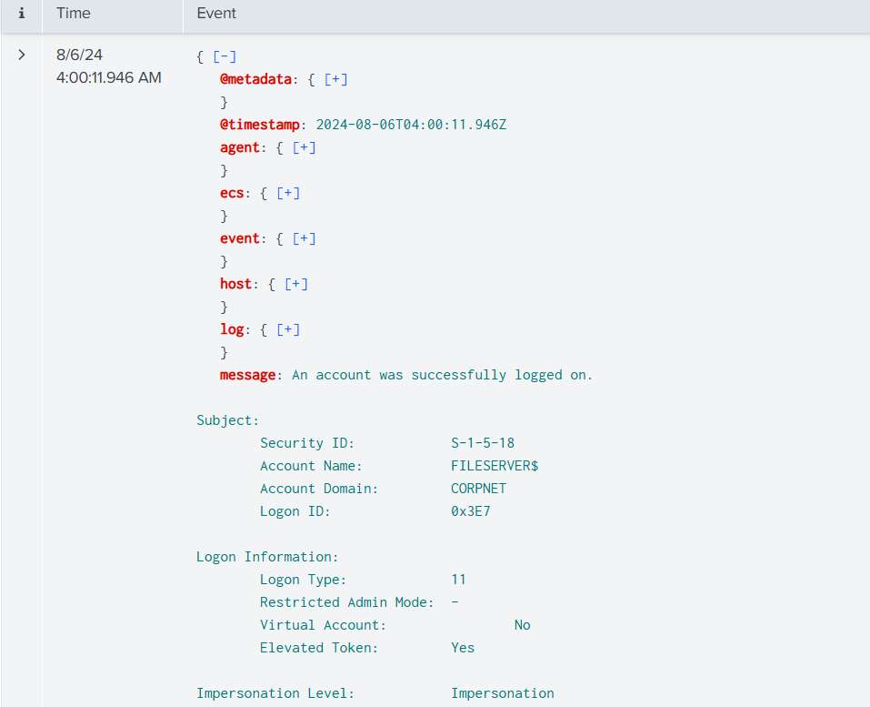
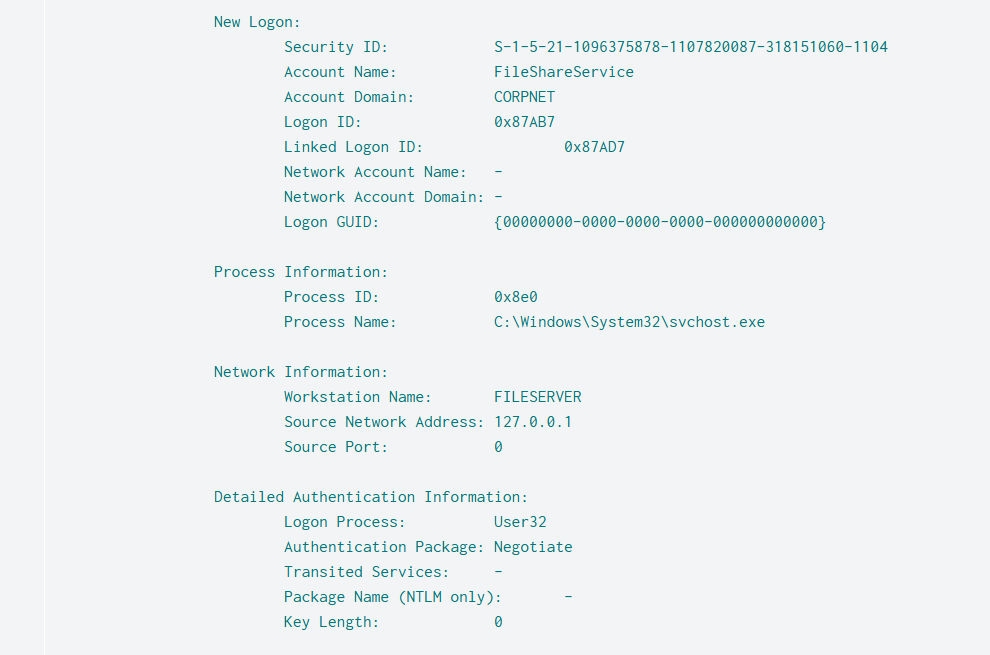

*Figure 3-4: Successful logon attempt (event code 4624), Logon ID `0x87AD7` - 04:00:11.946*

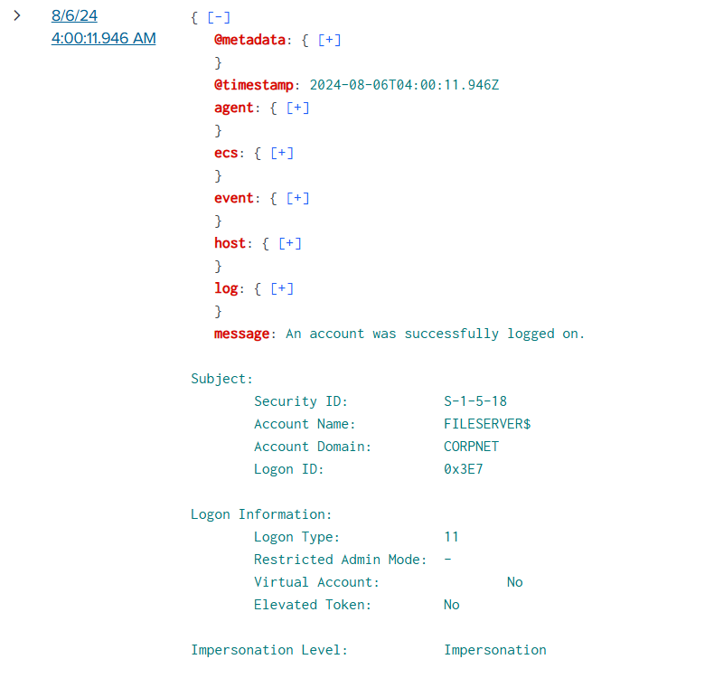
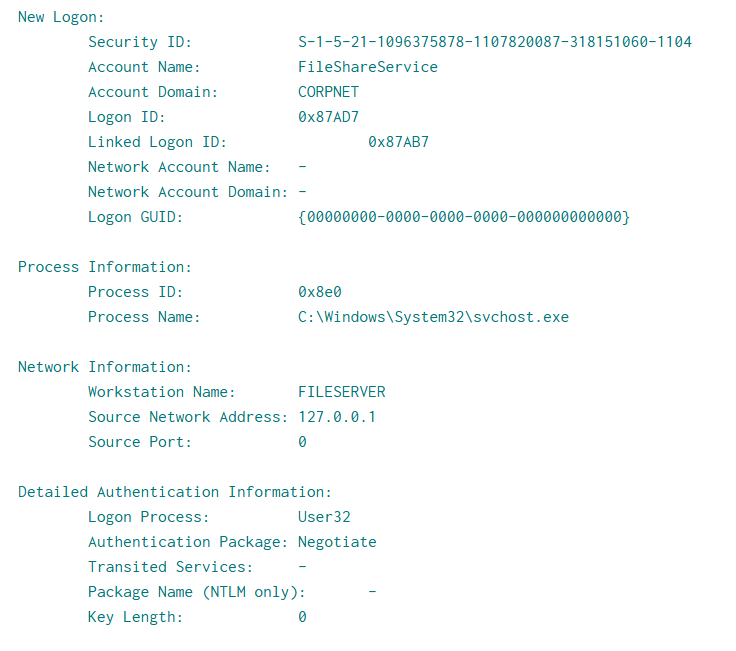

*Figure 5-6: Successful logon attempt (event code 4624), Logon ID `0x87AB7` - 04:00:11.946*

- **Verifying the actions that occurred after the logon**
  
  I then checked what events occurred after the logons and I noticed a suspicious process execution (`gkape.exe` - a tool used for live artifacts collection - executed at 04:01:04.155 from what seemed to be an USB device) but that was all I could find for these two sessions.

  **I only later in the investigation understood that `gkape.exe` was most probably executed by the DFIR team to extract artifacts from the infected device.**

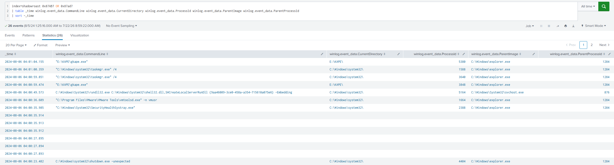

*Figure 7: Events for the 0x87AB7 and 0x87AD7 sessions - Suspicious gkape.exe execution - 04:00:59.474 & 04:01:04.155*

- **Pivoting by searching for suspicious parent-child relation with `explorer.exe` in the entire environment**
  
  I decided to expand the scope of my research by looking for all the processes spawned by `explorer.exe` to see if any other suspicious processes were launched by the same parent process in the environment. I found **a suspicious parent-child process execution**, as `powershell.exe` was executed by `explorer.exe` at 01:13:13.309 on `sanderson` account.

  I saw that a few moments before, at 01:05:11.925 and 01:05:15.353, a **suspicious process was executed** from the Downloads folder - `AdobeUpdater.exe`. 

[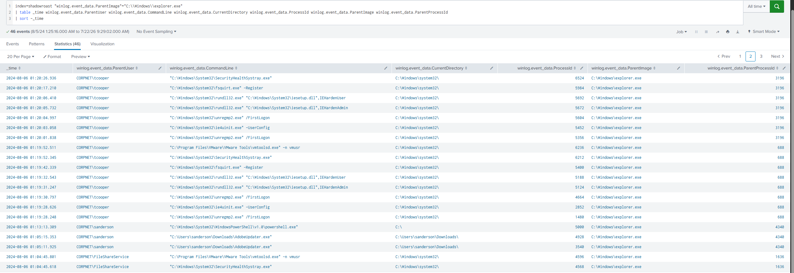](screenshots/8-powershell-execution.png)

*Figure 8: Powershell executed by explorer.exe - 01:13:13.309* 
*Suspicious process execution AdobeUpdater.exe - 01:05:11.925 and 01:05:15.353*  

 - **Investigating `AdobeUpdater.exe`**
   
   I opened the process execution event to know more about the suspicious process and found out that the original name is `ab.exe` and that is described as an **Apache HTTP server**. The binary was identified as ApacheBench, a legitimate Apache HTTP benchmarking utility repurposed by the attacker. I extracted the SHA256 hash (C15D55DC98D1ACDA85E15D360EC936F4CC6B91CBBBA0A25E6D1728F6882995C6) and did a reputation check on VirusTotal and Hybrid Analysis but no results were found.

   **The source of `AdobeUpdater.exe` couldn't be established** as no events corresponding to its creation were found, nor other leads that could indicate its origin.

   It is highly probable that the file was downloaded by the user `sanderson` on a malicious website using masquerading technique to appear as a legitimate Adobe website as it is present in the `Downloads` directory of the user.  This theory needs to be confirmed by asking the user where the file was downloaded. 

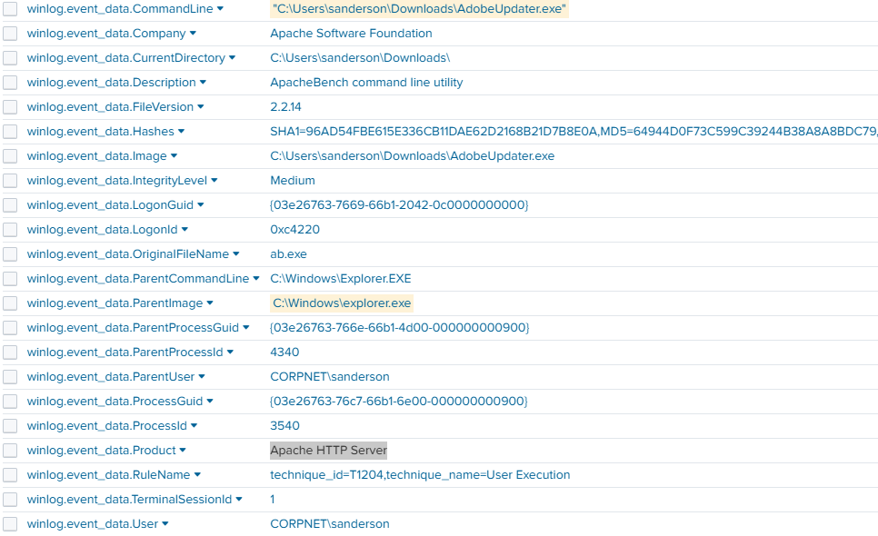

*Figure 9: Informations about AdobeUpdater.exe*

- **Analyzing the behaviour of AdobeUpdater.exe**

  I then filtered for all events containing AdobeUpdater.exe to gather information about its behavior post-execution. I found out that it **established a connection** (event code 3) to `223[.]247[.]47[.]74` over port 80. It also **made a key registry modification** to establish **persistence** by creating a run key, which launches a command when the user logs on (see below for more explanation). After that, it **created 3 files** (event code 11) : `BackupUtility.exe`, `SystemDiagnostics.ps1` and `DefragTool.exe`.

   **With this information, I classified `AdobeUpdater.exe` as a trojan, a malicious file disguised as a legitimate software. Its behaviour corresponds to the one of a malware dropper as it made it seemed to have made a connection to fetch the files at 223[.]247[.]47[.]74 over port 80.**

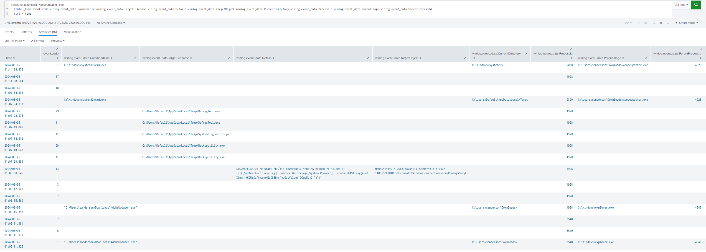

*Figure 10: Behaviour of `AdobeUpdater.exe`* 
*Network connection - 01:05:17.968* 
*Registry key modification - 01:05:58.546* 
*File creation: `BackupUtility.exe` - 01:07:09.683, `SystemDiagnostics.ps1` - 01:07:14.512, `DefragTool.exe` - 01:07:19.809* 

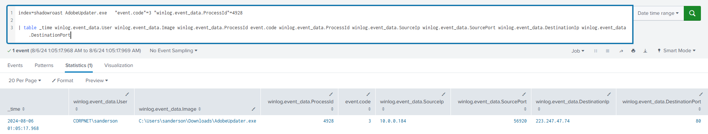

*Figure 11: Connection to 223[.]247[.]47[.]74 over port 80 - 01:05:17.968*

- **Analyzing the registry key modification**

  As visible on Figure 10, `AdobeUpdater.exe` modified the registry to create a run key named `wyW5PZyF`. This key executes a command to launch `cmd.exe`, that also launches a `powershell.exe` window in hidden mode, that will execute the code encoded in Base64 situated in  `HKCU:\Software\EdI86bhr\OQqd5sjJ`.

   **This is a typical way for malwares to establish persistence** by modifying registry and creating run keys that are executed at the start of an user's session. 

- **Analyzing the files dropped**
  
  I filtered for process execution (event 1) events containing `BackupUtility.exe`, `SystemDiagnostics.ps1` and `DefragTool.exe` to gather information about the binaries.
  
  I found out that `BackupUtility.exe` original name is **Rubeus.exe**, a tool used by red teamers to abuse the Kerberos protocol in Active Directory in order to extract tickets and credentials. After doing a reputation check of the SHA256 file's hash (1BFBEFA4FF4D0DF3EE0090B5079CF84ED2E8D5377BA5B7A30AFD88367D57B9FF) on VirusTotal (https://www.virustotal.com/gui/file/1bfbefa4ff4d0df3ee0090b5079cf84ed2e8d5377ba5b7a30afd88367d57b9ff), and **I confirmed that the binary is indeed Rubeus and malicious**. 

  I also found out that `DefragTool.exe`'s original name is **Mimikatz.exe**, a tool used by penetration testers to extract credentials, password hashes and Kerberos tickets. I confirmed the true identity of the binary by doing a reputation check of the SHA256 file's hash (92804FAAAB2175DC501D73E814663058C78C0A042675A8937266357BCFB96C50) on VirusTotal (https://www.virustotal.com/gui/file/92804faaab2175dc501d73e814663058c78c0a042675a8937266357bcfb96c50), and **I confirmed that the binary is indeed Mimikatz and malicious**.

  I noticed that `DefragTool.exe` was executed on an other user account (`tcooper`) at 01:15:18.616, indicating possible **lateral movement** or **privilege escalation**.

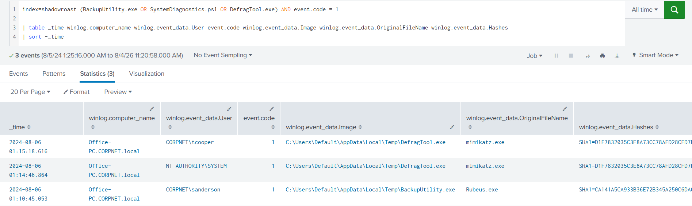

*Figure 12: Process execution, original names and hashes of `Defragtool.exe` and `BackupUtility.exe`*

- **Analyzing the behavior of the dropped files**

  I filtered for all the events containing the names of the dropped files and the dropper to gather more information about their behavior and found out that `SystemDiagnostics.ps1` was executed after the execution of the command `powershell -ep bypass` that allows an user to execute a Powershell script while bypassing the security restrictions.
  
  I analyzed the events linked to the script execution and found out that the author of the script is Will Schroeder (harmj0y) and identified the script used a **PowerView.ps1**, a tool used by red teamers to map and enumerate Active Directory's environment (see https://gist.github.com/HarmJ0y/184f9822b195c52dd50c379ed3117993). 

  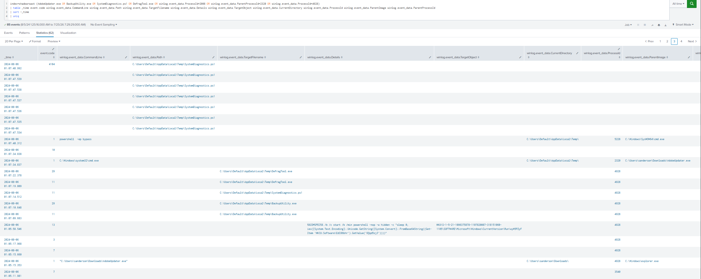

*Figure 13: `powershell -ep bypass` command executed - 01:07:40.312* 
*`SystemDiagnostics.ps1` executed - 01:07:47.534-01:07:48.992* 

 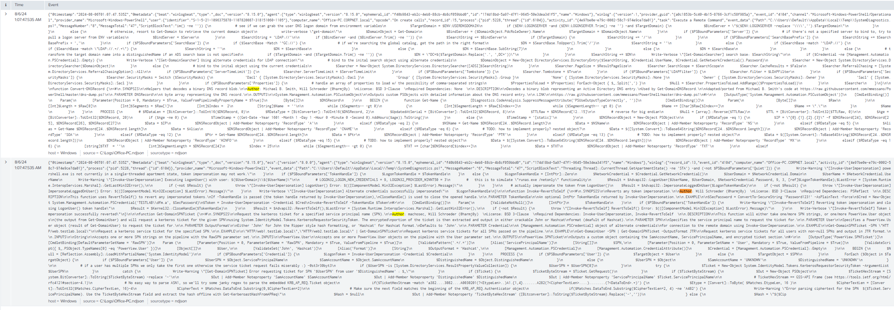

*Figure 14: Code of the malicious powershell script and author's name highlighted*

- **Investigating the lateral movement to `tcooper` account**

  After confirming the malicious nature of `AdobeUpdater.exe` and identifying the real files dropped by the malware and confirming that they were executed, I investigated what seemed to be lateral movement (see Figure 12, `DefragTool.exe` execution on `tcooper` account at 01:15:18.616). 

  I filtered for events code 4624 containing `tcooper` to find successful logons on the user's account. I then discovered that successful logons were initiated by `sanderson` session to the `tcooper` account by using `seclogon`, the Secondary Logon Service, that allows users to run programs and tasks using a different user account.
  
  **This finding confirmed that the attacker successfully executed lateral movement on the compromised device by using compromised `sanderson` account.**
  
  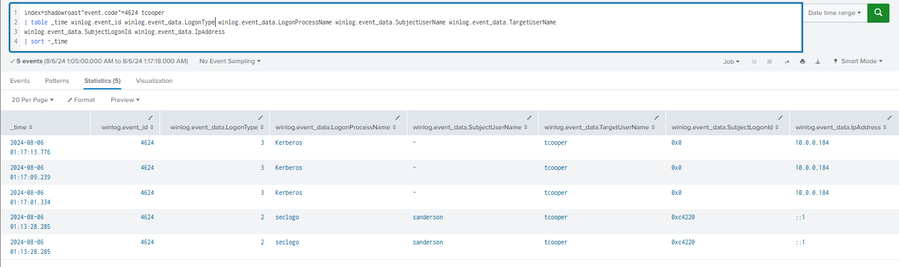

*Figure 15: Successful logon on `tcooper` account via `seclogon` from `sanderson` account - 01:13:28.285*

- **Analyzing the logon via seclogon**

  To understand how the attacker managed to connect to `tcooper` account I filtered for all the events that occurred in a time window of 15 seconds around the successful logon event. I found that beforehand, the attacker requested a Ticket Granting Ticket (event code 4768). This TGT was used to request a Ticket Granting Service (event code 4769) for Office-PC, enabling the attacker to authenticate as tcooper on OFFICE-PC (Event code 4624).

  **The attacker most probably obtained tcooper's NTLM hash and used it to request the TGT and then the TGS, to use this authenticated identity to create a genuine interactive logon session as tcooper via seclogon without having accessed the plaintext password, using an *Overpass the Hash technique*.**

  However how the attacker obtained the NTLM hash still remains unknown, thus this theory remains unconfirmed but highly probable.

  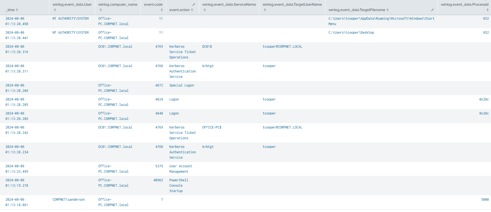

*Figure 16: Ticket Granting Ticket request (event code 4768) for `tcooper` - 01:13:28.234* 
*Ticket Granting Service request (event code 4769) for `Office-PC` on `tcooper` account - 01:13:28.242* 
*Logon on `tcooper` account (event code 4624) on `Office-PC` - 01:13:28.285* 

- **Investigating the activity on `tcooper` account**

  I kept my filter to look for any events containing the keywords corresponding to the malicious files' names and investigated their behavior after lateral movement to the `tcooper` account.

   I found that `DefragTool.exe` (Mimikatz.exe) executed DNS queries (event code 22) to resolve the Domain Dontroller `DC01` (10.0.0.147) and the File Server `FileServer` (10.0.0.161) and connected to `DC01` (event code 3) over LDAP (port 389) and RPC (port 135).

  Shortly after, `powershell.exe` connected to the File Server over WinRM (port 5985). This suggests the attacker first interacted with the domain controller, possibly to query or extract directory data, before using PowerShell over WinRM to **move laterally to `FileServer`** using Windows Remote Management.

  **The activity on `tcooper` account tends to show that this account was targeted because it has more privileges, like being able to connect to `FileServer` over WinRm, thus the logon to `tcooper` account can with a high probability be qualified as privilege escalation. This needs to be confirmed by having access to `tcooper`'s privileges.**

  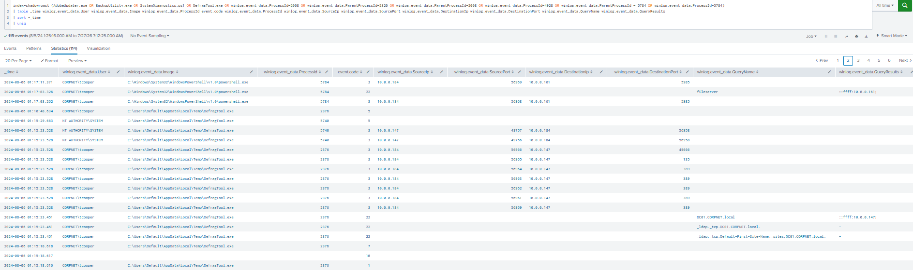

*Figure 17: DNS query (event code 22) for `DC01.CORPNET.local` - 01:15:23.451* 
*Connections to `DC01` (event code 3) - 01:15:23.528* 
*DNS query (event code 22) for `fileserver` - 01:17:03.326* 
*Connection (event code 3) to  `FileServer` - 01:17:03.262 & 01:17:11.371* 
  
  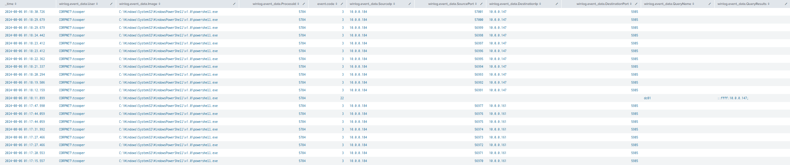

*Figure 18: Connections to `FileServer` via `powershell.exe` over WinRM- 01:17:15.557 -> 01:17:47.990* 
*Connections to `DC01` via `powershell.exe` over WinRM - 01:18:12.159 -> 01:18:30.726* 

- **Analyzing the events following the connections**
  
  As the filter I used for the previous step led to events stopping at 01:18:30.726, I decided to filter for all the events occurring in a 10 seconds time window around this event to know what happened.

  I found out activity on `DC01`, following the connection from `Office-PC` initiated by `tcooper`, one of the compromised accounts. I decided to analyze the `Request handling` event (event code 91) and found that a WSman shell - **a remote command-line execution shell** - was created on `DC01` by `tcooper` with the IP address `10.0.0.184`, corresponding to the IP address of `Office-PC`.

  The event was followed by `wsmprovhost.exe` process execution (event code 1), a process used for **remote commands and remote PowerShell sessions**, initiated by `tcooper` on `DC01`.

  This finding confirmed that the attacker executed lateral movement from `Office-PC` to `DC01` using Windows Remote Management.

    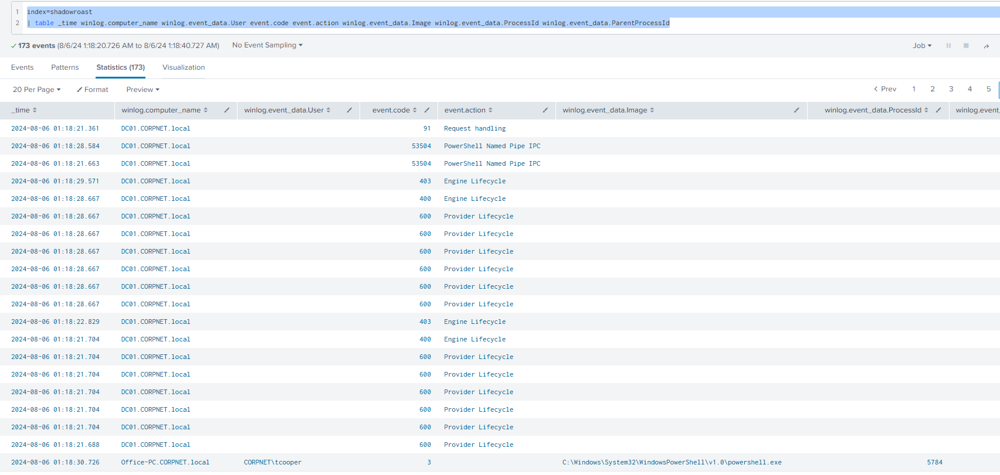

*Figure 19: Connection from `Office-PC.CORPNET.local` initiated by `tcooper` (see figure 18) - 01:18:30.726* 
*`Request handling` event on `DC01.CORPNET.local` - 01:18:21.361* 

  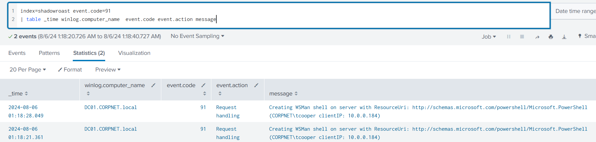
  
*Figure 20: Details of `Request handling` event (event code 91), showing that a WSMan shell was created on `DC01.CORPNET.local` - 01:18:21.361 & 01:18:24.049*

- **Investigating the activity on DC01**

  I continued analyzing the activity occurring on `DC01` and found out that the following command was executed: `"C:\Windows\system32\netsh.exe" firewall set service remoteadmin enable`. This command is used to open **remote administrative service on the endpoint**. I also found that registry key modification occurred **to allow Remote Desktop Protocol traffic on port 3389 in the firewall's rules.**

  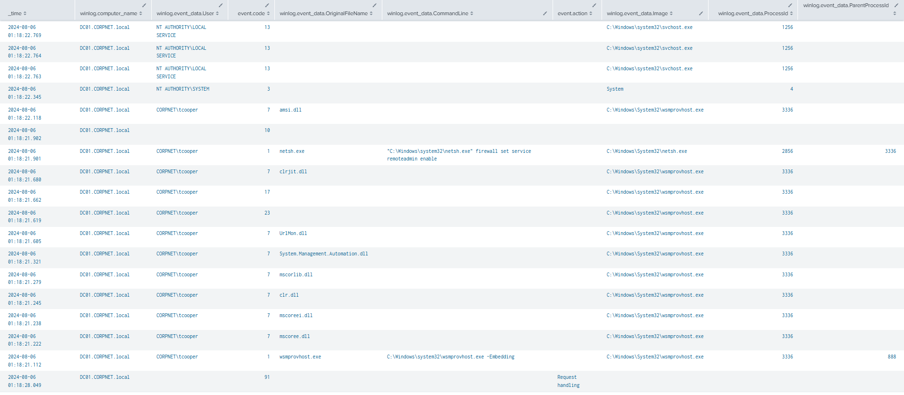

*Figure 21: Remote administrative services enabled on `DC01.CORPNET.local` - 01:18:21.901*

  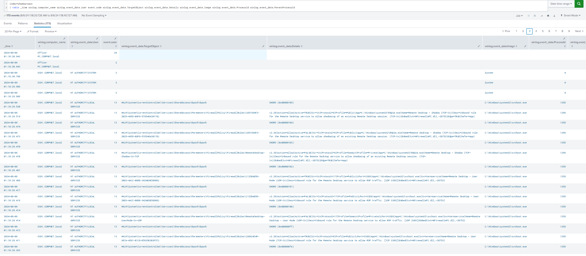

*Figure 22: Remote Desktop Protocol allowed on port 3389 in the firewall's rules on `DC01.CORPNET.local` - 01:18:29.411 -> 01:18:29.519*

- **Verifying if connection through Remote Desktop Protocol was attempted**

  I then filtered for events with 3389 as destination port to see if any remote desktop connection has been attempted and found that **two connections (event code 3) occurred from `223[.]247[.]47[.]74` via Remote Desktop Protocol to `10.0.0.147` (DC01) and `10.0.0.161` (FileServer).**

  I filtered for all events containing `223[.]247[.]47[.]74` and saw that two successful logon events occurred (event code 4624) and I also found their corresponding event 1149 (from the Remote Connection Manager) .
  
  I investigated the events from the Remote Connection Manager as they log the target user name and source IP address of the remote connection attempts and confirmed that the attacker successfully connected to `DC01` and `FileServer` via Remote Desktop Protocol using `tcooper` compromised account. 
  
  **This finding confirmed that the attacker successfully impaired the defenses of `FileServer` and `DC01` to enable remote access to these endpoints via an external device.**

  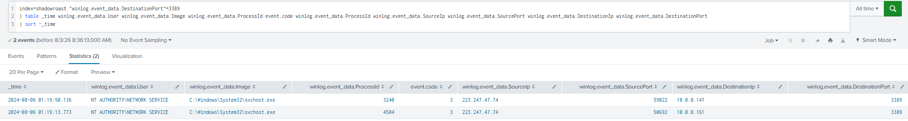

*Figure 23: Remote Desktop Protocol connection from `223[.]247[.]47[.]74` to `10.0.0.161` (FileServer) - 01:19:13.773* 
*Remote Desktop Protocol connection from `223[.]247[.]47[.]74` to `10.0.0.147` (DC01). - 01:19:50.136* 

  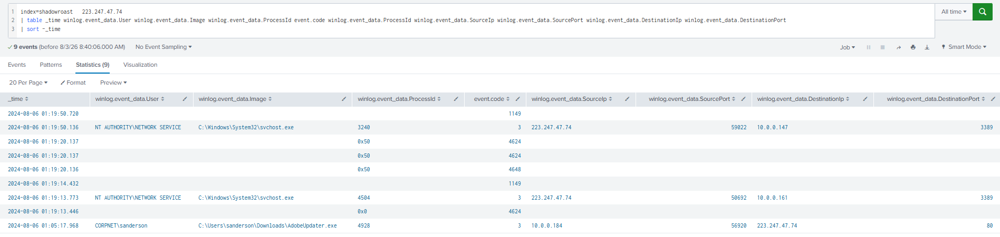

*Figure 24: Events containing `223[.]247[.]47[.]74`* 
*Successful logon events (event code 4624) - 01:19:20.137* 
*Events 1149 - 01:19:14.432 and 01:19:50.720* 

  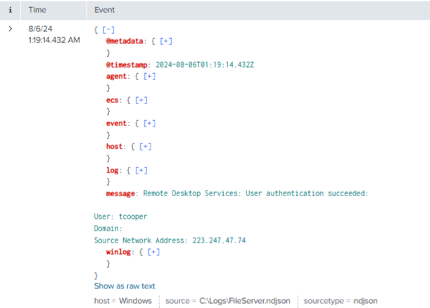

*Figure 25: Successful Remote Desktop Protocol connection with `tcooper` account on `FileServer` - 01:19:14.432*

  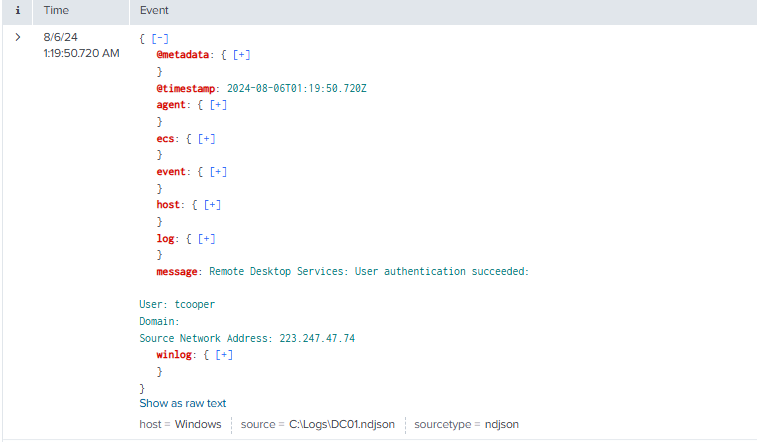

*Figure 26: Successful Remote Desktop Protocol connection with `tcooper` account on `DC01` - 01:19:50.720*

- **Verifying how `FileServer` was compromised**

  After finding that a successful Remote Desktop Protocol occurred on `FileServer`, I investigated the workstation's logs to understand how it happened and filtered for events containing `wsmprovhost.exe` as it was the process executed to **establish remote code execution** on `DC01`.

   I found that `wsmprovhost.exe` was also launched by `tcooper` on `FileServer`.

  **This finding indicates that the attacker made a lateral movement and that the `FileServer` endpoint has also been compromised.**

  I kept looking at the events and found that the same command as the one executed on `DC01` was run: `"C:\Windows\system32\netsh.exe" firewall set service remoteadmin enable`,  used to open **remote administrative service on the device**.

  I filtered for key registry modification (event code 13) containing `Remote` and found that the same registry key modification occurred **to allow Remote Desktop Protocol traffic on port 3389 in the firewall's rules.**

  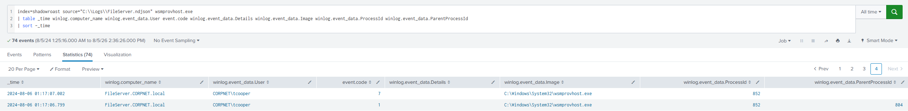

*Figure 27: `wsmprovhost.exe` execution (event code 1) by `tcooper` on `FileServer` - 01:17:07.002*

  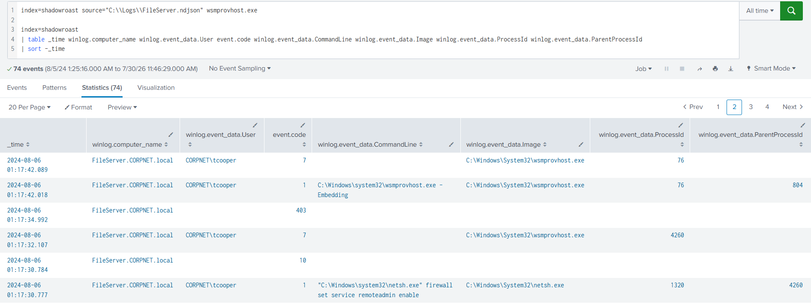

*Figure 28: Remote administrative services enabled on `FileServer` - 01:17:30.777*

  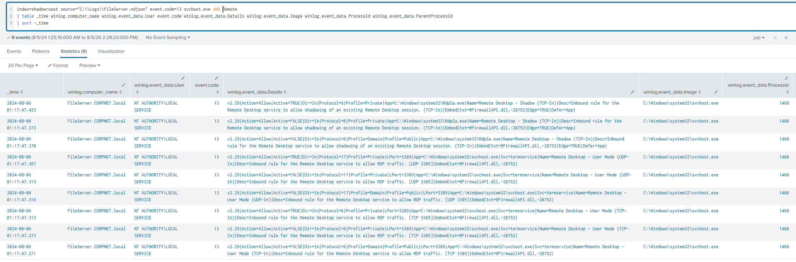

*Figure 29: Remote Desktop Protocol traffic allowed in Firewall through key registry modification (event code 13) on  `FileServer` - 01:17:47.271 -> 01:17:47.423*

- **Identifying the actions on objective**
  
  After having established that `DC01` and `FileServer` were compromised, I tried to identify the actions on objectives of the attacker by filtering for events containing `powershell.exe` or `cmd.exe` and found that the attacker executed the command `“C:\Windows\System32\WindowsPowerShell\v1.0\powershell.exe” -noexit -command Set-Location -literalPath ‘C:\Shares’` to  execute `powershell.exe` (PID 6948) in the `C:\Shares\` directory, indicating that the attacker had actions on objectives in this specific directory, containing most probably the shared files from the `FileServer`.

  By following the events I found that the powershell.exe process (PID 6948) created a file (event code 11) named `CrashDump.zip` in `C:\Users\Default\Local\Temp\` directory. 

  **This finding indicates that there is a high probability that the attacker created a .zip archive of the files present in the `C:\Shares\` directory.**
  

  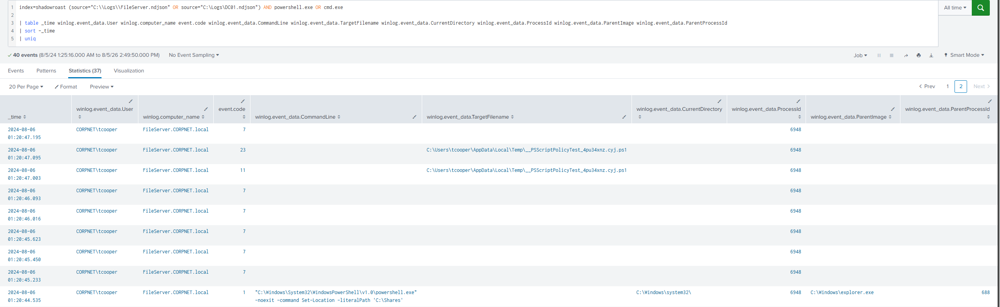

*Figure 30: `powershell.exe` (PID 6948) launched in `C:\Shares` folder in `FileServer` - 01:20:44.535*

  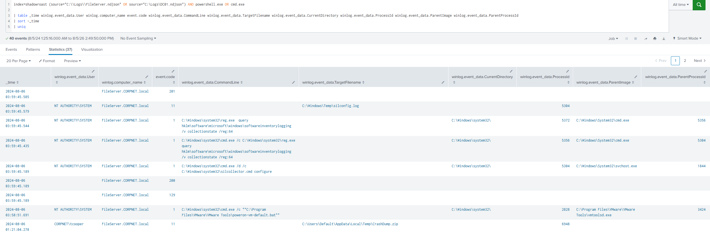

*Figure 31: `CrashDump.zip` (PID 6948) created by `powershell.exe` (PID 6948) - 01:21:04.278*

- **Establishing if files extraction occurred**

  As the attacker accessed `FileServer` via Remote Desktop Protocol there is **a high probability that the file was extracted via Remote Desktop Protocol clipboard**, which would not leave traces in the logs.
  
  To establish if `CrashDump.zip` was extracted using other methods I looked for any events containing the name of the .zip and the only event that I found was the one of its creation.

  I also looked for the connections (event code 3) or DNS queries (event code 22) that occurred after the file's creation to find any trace of extraction, but I didn't find any substantial proof that the file was extracted through these methods.

- **Investigating the attacker's actions after the .zip creation**
  
  After establishing the actions of the attacker since the execution of `AdobeUpdater.exe` until the creation of `CrashDump.zip`, I checked what happened after and found a time gap between 01:23:32.000 and 03:53:05.021.
  
  I found that activity on `sanderson` account started again at 03:52:54.311 when the user logged on (event code 4624).

  After the logon, I found that **the registry key used to establish persistence and a Powershell script were executed, confirming that at that time the endpoint was still compromised.**
  
   For safety reasons, the full PowerShell payload is not included in this report. The original artifact has been safely preserved and will be securely provided to the DFIR team for controlled reverse engineering.

  I found that afterwards `gkape.exe` was run by `sanderson` and there is a high probability that it was run by the DFIR team to capture live artifacts from the user's session as it was run from `E\KAPE\Gkape.exe` which indicates that it was probably executed from a USB key device.

  **The logon on `sanderson` account at 03:52:54.311 and the one that occurred on the `FileShareService` account at 04:00:11.946 were most probably initiated by the DFIR team as no malicious activity were detected on these sessions** - the Powershell script that was run was initiated by the registry key launched because of the persistence mechanism activated at each session's start - and `gkape.exe` was run on both users' account.

  **This must be confirmed by the DFIR team to ensure that this activity was not malicious**.

 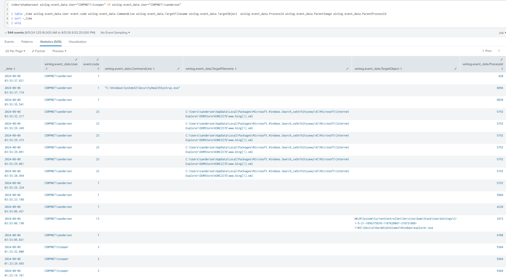

*Figure 32: Time gap between 01:23:32.000 and 03:53:05.021*

 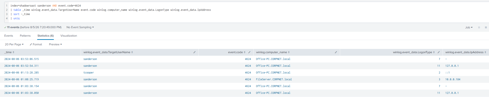

*Figure 33: Logon of `sanderson` - 03:52:54.311*

 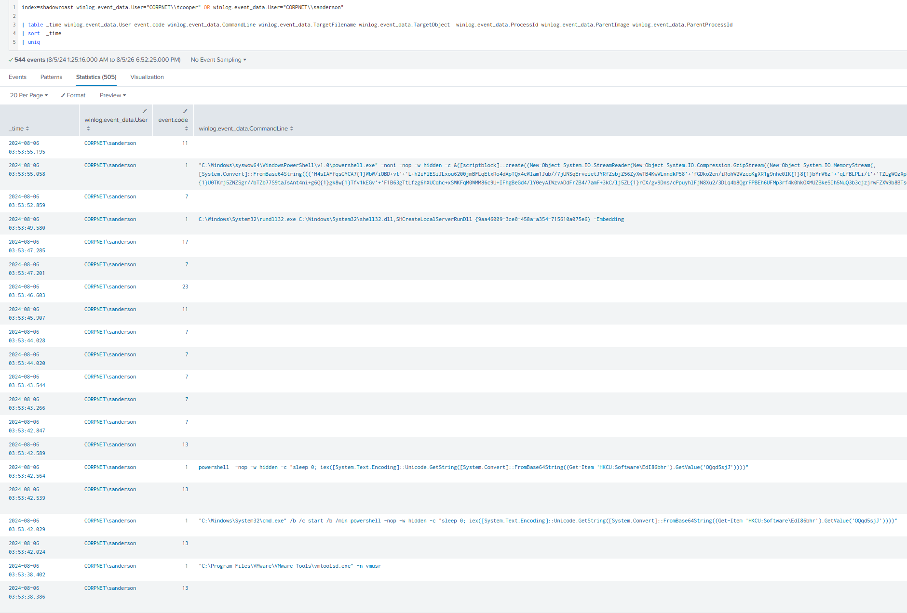

*Figure 34: Run key executed - 03:53:42.029* 
*Powershell script executed - 03:53:55.058* 

 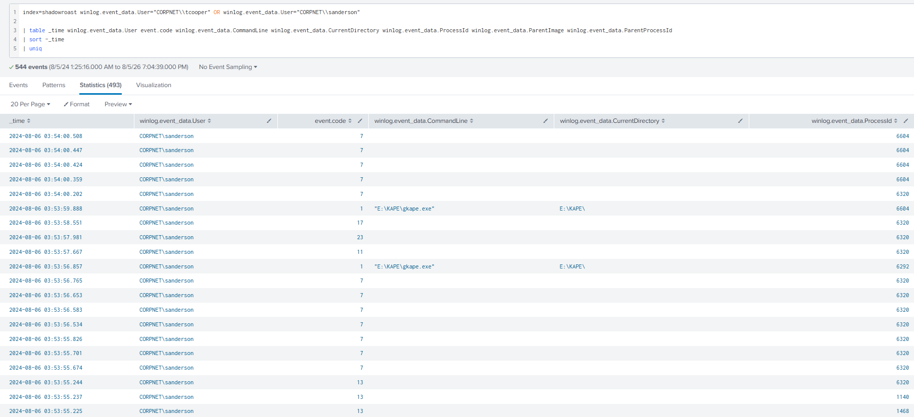

*Figure 35: `gkape.exe` executed - 03:53:56.857 & 03:53:59.888*
  
## Section 5: Incident Timeline & MITRE ATT&CK Mapping

| Time | Workstation | Account | Event | Reference | MITRE ATT&CK |
|---|---|---|---|---|---|
| 01:05:11.925 | Office-PC | sanderson | Process execution: AdobeUpdater.exe (Apache HTTP server)  **PID 3540**| Section 3: Figure 8 | User Execution - T1204.002 - Malicious File & Stealth - T1036.005 - Masquerading: Match Legitimate Resource Name or Location | 
| 01:05:15.353 | Office-PC | sanderson | Process execution: AdobeUpdater.exe (Apache HTTP server)  **PID 4928** | Section 3: Figure 8 | User Execution - T1204.002 - Malicious File & Stealth - T1036.005 - Masquerading: Match Legitimate Resource Name or Location | 
| 01:05:17.968 | Office-PC | sanderson | Network connection initiated by **PID 4928** to 223[.]247[.]47[.]74[:]80 | Section 3: Figure 10 | Command & Control - T1071.001 – Application Layer Protocol: Web Protocols | 
| 01:05:58.546 | Office-PC | sanderson | Run registry key modification (wyW5PZyF) by **PID 4928**| Section 3: Figure 10 | Persistence - T1547 - Boot or Logon Autostart Execution: Registry Run Keys / Startup Folder| 
| 01:07:09.683 | Office-PC | sanderson | File creation by PID 4928: BackupUtility.exe (Rubeus.exe)  | Section 3: Figure 10 - 12| Command & Control - T1105 - Ingress Tool Transfer  & Stealth - T1036.005 - Masquerading: Match Legitimate Resource Name or Location | 
| 01:07:14.512 | Office-PC | sanderson | File creation by PID 4928: SystemDiagnostics.ps1 (PowerView.ps1)  | Section 3: Figure 10 - 14| Command & Control - T1105 - Ingress Tool Transfer  & Stealth - T1036.005 - Masquerading: Match Legitimate Resource Name or Location | 
| 01:07:19.809 | Office-PC | sanderson | File creation by PID 4928: DefragTool.exe (Mimikatz.exe)  | Section 3: Figure 10 - 12  | Command & Control - T1105 - Ingress Tool Transfer  & Stealth - T1036.005 - Masquerading: Match Legitimate Resource Name or Location | 
| 01:07:47.534| Office-PC | sanderson | Powershell script executed by PID 4928 via cmd.exe/Powershell.exe: SystemDiagnostics.ps1  | Section 3: Figure 13  | Execution - T1059.001 - Command and Scripting Interpreter: PowerShell & Discovery - TA0007 | 
| 01:10:45.053| Office-PC | sanderson | Process execution: BackupUtility.exe  | Section 3: Figure 12  | Tool - S1071 - Rubeus & Discovery - T1482 - Domain Trust Discovery & Credential Access -  T1558 - Steal or Forge Kerberos Tickets | 
| 01:13:28.285| Office-PC | sanderson | Logon via seclogon (Logon type 2: interactive session) to the **tcooper account** | Section 3: Figure 15  | Lateral Movement - TA0008 |
| 01:15:18.616| Office-PC | **tcooper** | Process execution: DefragTool.exe | Section 3: Figure 12  | Tool - S0002 - Mimikatz & Credential Access - TA0006 |
| 01:17:07.002| **FileServer** | tcooper | Process execution: wsmprovhost.exe (Windows Remote Management) | Section 3: Figure 27  |Lateral Movement - T1021.006 - Remote Services: Windows Remote Management|
| 01:17:30.777| FileServer | tcooper | Remote administrative services enabled on the firewall | Section 3: Figure 28 | Defense Impairment - T1686 - Disable or Modify System Firewall |
| 01:17:47.271-> 01:17:47.423| FileServer | tcooper | Remote Desktop Protocol allowed on port 3389 in the firewall's rules | Section 3: Figure 29 | Defense Impairment - T1686 - Disable or Modify System Firewall |
| 01:18:21.361| **DC01** | tcooper | WSMan shell created by tcooper for remote management| Section 3: Figure 20 |Lateral Movement - T1021.006 - Remote Services: Windows Remote Management |
| 01:18:21.901| DC01 | tcooper | Remote administrative services enabled on the firewall | Section 3: Figure 21 | Defense Impairment - T1686 - Disable or Modify System Firewall |
| 01:18:29.411 -> 01:18:29.519| DC01 | tcooper | Remote Desktop Protocol allowed on port 3389 in the firewall's rules | Section 3: Figure 22 | Defense Impairment - T1686 - Disable or Modify System Firewall |
| 01:19:14.432| FileServer | tcooper | Remote Desktop Protocol connection by 223[.]247[.]47[.]74 | Section 3: Figure 25 | Lateral Movement - T1021.001 – Remote Desktop Protocol |
| 01:19:50.720| DC01 | tcooper | Remote Desktop Protocol connection by 223[.]247[.]47[.]74 | Section 3: Figure 26 | Lateral Movement - T1021.001 – Remote Desktop Protocol |
| 01:20:44.535 | FileServer | tcooper | Process execution: powershell.exe (**PID 6948**) executed in **C:\Shares** directory | Section 3: Figure 30 | Execution - T1059.001 – Command and Scripting Interpreter: PowerShell |
| 01:21:04.278 | FileServer | tcooper | File creation by **PID 6948** : CrashDump.zip | Section 3: Figure 31 | Collection - T1560 - Archive Collected Data |
| 03:52:54.311 | Office-PC | sanderson | User logon: sanderson | Section 3: Figure 33| Activity of the DFIR team - to be confirmed |
| 03:53:42.029 | Office-PC | sanderson | Registry run key execution: wyW5PZyF |  Section 3: Figure 34 |  Persistence - T1547 - Boot or Logon Autostart Execution: Registry Run Keys / Startup Folder|

## Section 6: Indicators of Compromise (IOCs)

| Type | Indicator | Context |
|---|---|---|
| Account name | sanderson  |   Compromised account | 
| Account name | tcooper  |   Compromised account | 
| Endpoint name | Office-PC |   Compromised endpoint | 
| Endpoint name | DC01 |   Compromised endpoint (Domain Controller) | 
| Endpoint name | FileServer |   Compromised endpoint | 
| File name | AdobeUpdater.exe  |   Malicious file (Repurposed Apache HTTP server benchmarking tool)  | 
| File SHA256 hash | C15D55DC98D1ACDA85E15D360EC936F4CC6B91CBBBA0A25E6D1728F6882995C6 | Hash of AdobeUpdater.exe |
| File name | BackupUtility.exe  |   Malicious file (Rubeus.exe)  | 
| File SHA256 hash |1BFBEFA4FF4D0DF3EE0090B5079CF84ED2E8D5377BA5B7A30AFD88367D57B9FF | Hash of BackupUtility.exe | 
 | File name | DefragTool.exe |   Malicious file (Mimikatz.exe)  | 
| File SHA256 hash | 92804FAAAB2175DC501D73E814663058C78C0A042675A8937266357BCFB96C50 | Hash of DefragTool.exe | 
 | File name | SystemDiagnostics.ps1 |   Malicious file (PowerView.ps1)  | 
| IP Address | 223[.]247[.]47[.]74  |   Attacker source IP / HTTP Server destination for AdobeUpdater.exe (over port 80) | 
| Registry key | HKU\S-1-5-21-1096375878-1107820087-318151060-1105\SOFTWARE\Microsoft\Windows\CurrentVersion\Run\wyW5PZyF |   Registry run key used for malware's persistence |
 | Registry key | HKCU:\Software\EdI86bhr\OQqd5sjJ |   Registry key containing malicious code to execute at run |
 | Registry keys |  HKLM\System\CurrentControlSet\Services\SharedAccess\Parameters\FirewallPolicy\FirewallRules\* |   Registry keys to enable RDP in the firewall's rules on DC01 and FileServer |
 | File name and path | C:\Users\Default\Local\Temp\CrashDump.zip | Compressed file created on FileServer for a possible data extraction |

## Section 7: Suggested Defensive Measures

### Critical Priority:

- **Persistence mechanism:**
  
  - Remove the registry run key `HKU\S-1-5-21-1096375878-1107820087-318151060-1105\SOFTWARE\Microsoft\Windows\CurrentVersion\Run\wyW5PZyF`, present on `Office-PC`, which is launched at the start of `sanderson`'s session to execute a malicious PowerShell script stored in `HKCU:\Software\EdI86bhr\OQqd5sjJ`.
  - Remove the malicious script located in `HKCU:\Software\EdI86bhr\OQqd5sjJ` as well, and verify whether `wyW5PZyF` or `OQqd5sjJ` is present on any other endpoints in the environment.
     Verify their presence on the File Server and Domain Controller as a priority, as these systems were also compromised by the attacker.

- **Credentials:**

  Reset the credentials of `sanderson` and `tcooper`, as both accounts were compromised, and enforce a group security password policy requiring long, complex passwords if it's not already the case. 

- **IP address:**

  Block `223[.]247[.]47[.]74` on the organization's firewall, as this IP address was most probably used by the dropper to fetch additional malicious files and was also used by the attacker to connect to the File Server and Domain Controller over RDP on port 3389.

- **Firewall rules:**

  Disable the rules enabling Remote Desktop Protocol connections over port 3389 and remote administrative services on the File Server and Domain Controller, to prevent the attacker from reconnecting to these endpoints from external devices.

- **Malicious files:**

  Remove the following malicious files from `Office-PC`:
  - `AdobeUpdater.exe` (Apache HTTP Server) — SHA256: `C15D55DC98D1ACDA85E15D360EC936F4CC6B91CBBBA0A25E6D1728F6882995C6`
  - `BackupUtility.exe` (Rubeus.exe) — SHA256: `1BFBEFA4FF4D0DF3EE0090B5079CF84ED2E8D5377BA5B7A30AFD88367D57B9FF`
  - `DefragTool.exe` (Mimikatz.exe) — SHA256: `92804FAAAB2175DC501D73E814663058C78C0A042675A8937266357BCFB96C50`
  - `SystemDiagnostics.ps1` (PowerView.ps1)

  Additionally, check whether any of these files, or files matching their hashes, are present elsewhere in the organization's environment, and remove them if found.

### High Priority:

- **Potential data exfiltration:**

  Verify whether `C:\Users\Default\Local\Temp\CrashDump.zip` is still present in the environment, and determine which files it contains.

  **Only the DFIR team should interact with this file**, as its contents are currently unknown.
  
  Given the high likelihood that the file was exfiltrated, if it is found to contain sensitive data, this information should be shared with the relevant stakeholders.

- **Credential Guard:**

  Enable Credential Guard, a Windows feature that uses Virtualization-Based Security (VBS) to isolate and protect sensitive credentials such as NTLM hashes and Kerberos tickets. This would help prevent Overpass-the-Hash attacks carried out using tools like Rubeus, as observed in this incident.

- **EDR Tuning:**
  - Implement rules on the EDR to detect modifications to firewall rules stored in the registry at `HKLM\System\CurrentControlSet\Services\SharedAccess\Parameters\FirewallPolicy\FirewallRules\*`, in order to prevent an attacker from impairing the organization's defenses and enabling remote access to endpoints.
  - Additionally, implement a detection rule to alert on `wsmprovhost.exe` process creation events on domain controllers and other high-value assets, as this is a strong indicator of lateral movement via Windows Remote Management.
  - Enforce rules to alert on `powershell.exe` invoked with `-ep bypass` or `-w hidden`, as such commands were executed during this incident and allow an attacker to bypass execution policy restrictions or hide the PowerShell window from the user.
  - Enforce rules that alert when a process's original name does not match its file name on disk (e.g., `BackupUtility.exe`, whose original name is `Rubeus.exe`).

### Medium Priority:

- **AppLocker:**

  Enable AppLocker, a Windows security feature that only allows execution of signed/whitelisted applications and can block process execution from locations such as `Downloads`, `Desktop`, and `Temp` folders. This measure prevents users from executing malicious files. The execution of `AdobeUpdater.exe` was at the origin of this attack.

- **Least Privilege:**

  Implement the principle of least privilege across all accounts in the Active Directory environment, ensuring that each user is granted only the access and rights necessary to perform their duties. This limits the ability of malware executed under a standard user's context to access or modify critical environment components, and reduces the potential impact of a compromised account.

### Low Priority:

- **Centralized Software Management:**

  The IT team should be responsible for deploying, monitoring, updating, and securing applications. Software updates (such as Adobe updates) should be pushed via a managed deployment tool. This would prevent situations where users download and execute trojans disguised as legitimate software updates, as it occurred in this incident.

- **End User Awareness Training:**

  Although the origin of `AdobeUpdater.exe` could not be established based on the logs available, there is a high probability that it was downloaded by `sanderson` from a malicious website or via a phishing email. End users should be informed not to download executables on their own to install software or perform software updates, provided Centralized Software Management is implemented.
